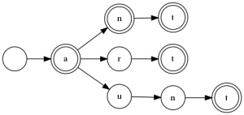

# Data Structures: Tries in Rust
>数据结构：用 Rust 实现 Tries

>* Data Structures: Tries in Rust 译文
>* 原文地址：https://elfsternberg.com/2019/08/05/data-structures-tries-in-rust/
>* 原文作者：[Elf Sternberg](https://github.com/elfsternberg)
>* 译文出自：https://github.com/suhanyujie/article-transfer-rs
>* 译者：[suhanyujie](https://github.com/suhanyujie)
>* tips：水平有限，翻译不当之处，还请指正，谢谢！

I recently went to a job interview (I’m looking for work, by the way; hire me!) and one of the questions put to me was “solve the [Boggle™](https://shop.hasbro.com/en-us/product/boggle:7EB3363D-5056-9047-F5B7-DC51516DFE25) board.” I don’t think I did very well on the question and it wasn’t until I got home that I remembered “Dammit, the fastest structure for checking if a word is in a dictionary is a trie!”
>我最近参加了一个工作面试（顺便说一下，我正在找工作；欢迎给我发面试邀请！）并且其中有一个问题是解决 [Boggle™](https://shop.hasbro.com/en-us/product/boggle:7EB3363D-5056-9047-F5B7-DC51516DFE25)。我想我对这个问题并不擅长，直到我回到家我才意识到“该死，查词的最快方式就是使用 trie 结构啊！”。

Whiteboard exercises are terrible. I don’t think I’ve ever actually programmed a trie, not even in Data Structures class I took way back in college in 19mumblemumble. I’m sure I’ve used them, but I’ve never had to write one.
>白板练习不是好办法。我想我之前从未有编写过 trie 相关程序的经验，甚至 19 届（19mumblemumble 如何翻译？）的大学中参加的数据结构课程上也没有过。我知道我用过，但从来没有去实现过。

## So what is a trie?
>trie 是什么？


A [trie](https://en.wikipedia.org/wiki/Trie) is a data structure that encodes _every word_ in a dictionary as a string of nodes, one per letter. This trie encodes the dictionary containing the words “a”, “an,” “ant”, “art”, and “aunt”. If we’re looking up “ant,” we start at the root node and traverse to “a”, then “n”, and then “t”. The “t” is double-circled, that is, it’s marked as a terminal node, and thus “ant” is in this dictionary. If we were looking up the word “any”, we would get to “a,n,” and then fail, because “any” is not in this dictionary. Likewise, we might ask if “aun” is in the dictionary, and we would get to “a,u,n,” but that “n” is not double-circled, and thus “aun” is also not a complete word in this dictionary.
>[trie](https://en.wikipedia.org/wiki/Trie) 是一种数据结构，它将字典中的 _每个单词_ 编码为一个节点字符，每个字母一个。例如 trie 可以将一个字典编码为包含 `a`，`an`，`ant`，`art` 和 `aunt` 的 trie。如果我们查找 `ant`，我们从根节点开始，遍历到 `a`，然后是 `n`，然后是 `t`。`t` 是“双圈”的，也就是说，它被标记为终端节点，因此 `ant` 在这个字典中的。如果查询单词 `any`，我们会查到 `a`、`n`，然后失败，因为 `any` 并不在字典中。同样的，我们还能查询 `aun` 是否在字典中，我们会查询 "a, u, n"，但那个 `n` 不是“双圈”的，因此 `aun` 在字典里不是一个完整的单词。

Like a [regular expression](https://github.com/elfsternberg/riggedregex), a trie search is successful when the string is exhausted, the trie is still active, and we find ourselves on a node marked as a word terminator. If the trie exhausts before the string, or if the string exhausts on a non-terminating node, the search fails to find a complete word.
>与[正则表达式](https://github.com/elfsternberg/riggedregex)类似，一次成功的 trie 搜索意味着在字符串匹配完时 trie 的状态仍然是激活（匹配成功）状态，我们会发现此时处于一个标记为词的终端节点上。如果 trie 在字符串之前匹配完，或者在一个非终结符节点上结束，则意味着此次搜索将无法找到一个完整的单词。

The [rules of Boggle™](https://en.wikipedia.org/wiki/Boggle) are very simple: on a 4×4 grid, sixteen dice are shaken and dropped into place. Each die has six letters on it, probabilistically arranged. Players have three minutes to find every valid word on the board, where “valid” means “found in the dictionary the players have agreed to use,” modulo some rules like “no contractions or abbreviations.” The letters of the words must be adjacent in any of the eight cardinal directions (modulo the borders of the grid), and no letter may be used twice for the same word.
>[Boggle™ 规则](https://en.wikipedia.org/wiki/Boggle)非常简单：在一个 4*4 的网格中，摇动 16 个骰子并将其放在适当的位置。每个骰子有 6 个字母，按概率排列。玩家有三分钟的时间正确地找出黑板上预先写好的所有单词，正确的意思是“在字典中找到的，并且是玩家认同的”，以一些规则为模组，如“禁止缩写”。组成单词的字母必须在相邻的八个基本方向中（以网格的边框为模型），同一个单词不能有两个一样的字母。

So, to solve for Boggle, we need a fast lookup dictionary, and thus we need a trie. Tries are extremely fast, Ο(n) where `n` is the length of the word. They’re memory-intensive, but these days memory is cheaper than time. Each node has two conditions: the list of letters that it leads to, and whether or not it is a terminal node. For the “list of letters,” we’re going to use a [HashMap](https://doc.rust-lang.org/std/collections/struct.HashMap.html). The child nodes must be [Boxed](https://doc.rust-lang.org/std/boxed/struct.Box.html) as we’re building this on the heap (it will be _huge_ for a full-sized dictionary) and it must be [RefCell](https://doc.rust-lang.org/std/cell/struct.RefCell.html) because we’ll be mutating child nodes repeatedly as we build the trie.
>因此，为了玩好 Boggle，我们需要一个可以快速查找的字典，也就是 trie。Tries 是非常快的，它的时间复杂度 Ο(n) 中的 `n` 是指词的数量。它需要很多内存，但现在内存比时间更便宜。每个节点都有两个条件：它指向的字母列表，并且它是否是终端节点。对于“字母列表”，我们使用 [HashMap](https://doc.rust-lang.org/std/collections/struct.HashMap.html)。子节点必须是 [Boxed](https://doc.rust-lang.org/std/boxed/struct.Box.html)，我们将其构建在堆上（它是一个 _巨大的_ 全尺寸的字典），它必须使用 [RefCell](https://doc.rust-lang.org/std/cell/struct.RefCell.html)，因为我们会反复地使用子节点构建 trie。

For a canonical dictionary lookup, this implementation is different the Wikipedia page’s description.  There’s no utility to storing the node’s value in itself; we know what the value is by the key we used to reach it!  We do need to know if the node is a terminator node.
>对于一个规范的字典查找功能，这种实现与维基百科页面的描述不同。维基百科所描述的是对于没有存储节点值的实用程序；我们通过查询所到达的键是什么来了解对应的值！我们需要这个节点是否是终止节点（叶子节点）。

There are strong feelings about tuples vs structs for values with multiple fields, with most people preferring structs.  For a value with two fields, I feel a tuple ought to be adequate.  A record with so many fields it has to name them, and therefore a struct, has a code smell and is worth examining closely for cognitive complexity.  I’ll address that in the next post.
>对于具有多个字段的值，元组和结构体相比，大多数人更喜欢结构体。对于只有两个字段的值，我认为元组是可以满足要求的。一个记录如果有很多字段，那么必须给这些字段命名，因此这是应该使用结构体，在合适的场景使用合适的代码方案，需要仔细推敲。我将在下一篇解决这个问题。

```rust
pub struct Node(HashMap<char, Box<RefCell<Node>>, bool);
```

For this structure, we’re going to build it imperatively; that is, each word will be presented to the structure one at a time, and each word will be an iterator over its characters. The first thing we need to do is say, for a given node, if the word is exhausted, then we are a terminator node:
>对于这个结构体，我们将声明式地构建它；也就是说，每个单词将会呈现在结构体中，每个单词就是字符迭代器的结果。我们需要做的一件事是，对于给定的节点，如果这个词已经迭代完毕，那么此时就是一个终止节点：

```rust
impl Node {
    pub fn insert(&mut self, word: &mut Iterator<Item = char>) {
        let c = match word.next() {
            None => {
                self.1 = true;
                return;
            }
            Some(c) => c,
        };
```

Note that we’re returning from this function if we’re a terminator. There is no character to insert into the next node.
>记住，如果到达了终结符，我们就要从这个函数中进行 return 了。即使没有要插入下一个节点的字符。

If we’re not a terminator, we must then either access or create a child node, and then keep traversing the word until its exhausted. In the “create a new child” scenario, we create the full trie before inserting it.
>如果不是终结符，那么我们就必须访问或创建一个子节点，然后继续遍历这个单词，知道它结束。在“创建新的子节点”时，我们在插入前创建了完整的 trie。

```rust
        match self.0.get(&c) {
            None => {
                let mut newtrie = Node::new();
                newtrie.insert(word);
                self.0.insert(c, Box::new(RefCell::new(newtrie)));
            }
            Some(node) => {
                node.borrow_mut().insert(word);
            }
        };
    }
```

One tricky feature of Boggle™ is that we want to end a search for a word early if the “word” found isn’t really a word. That is, if on the board you find the sequence “tk”, no word starts with “tk” and you want the search to terminate early. But as in our example above, “aun” is also not a word, but we do not want to terminate the search, as there may be a handy ‘t’ nearby to finish the word.
>Boggle™ 的一个棘手特性是，如果发现的单词并不是查找的目标单词，我们希望尽快结束对单词的搜索。也就是说，例如，你需要找到序列“tk”，而没有单词是“tk”开头的，希望此次搜索尽快结束。但是在我们上面的例子中，“aun” 也不是一个单词，但是我们不想终止搜索，因为相近地可能有一个便捷的 “t” 来完成这个词的搜索。

So we want to be able to search the trie, but we have two different criteria: “is this a word” and “_could_ this be the prefix of a word?” We want our search engine to be able to handle both.
>因此我们希望能够这个 trie，但我们有两个不同的标准：“这是一个单词吗？”和“这 _会_ 是一个次的前缀吗？”我们希望我们的搜索引擎能够处理这两个问题。

How do we handle both? Let’s go back: what are the failure conditions? The trie gets exhausted _or_ the string gets exhausted. If both are exhausted at the same time and we’re on a terminator, it’s a word. If the word is exhausted but the trie is not, this is a prefix, regardless of its terminator status.
>我们如何处理这两个条件呢？我们先回顾一下：什么情况下条件失效？trie 搜完了 _或_ 字符串消耗完了。如果这两者同时耗尽，我们此时的查询已经结束，结果就是查询到的词。如果单词已耗尽，但 trie 没有，则无论其终止状态如何，结果都只是一个词的前缀。

So, our search feature will be a recursive function that, letter by letter, transits the trie node by node. If the word exhausts and we’re still in the trie, we check the end state (always `true` for a prefix, `is a terminator` for a word), otherwise we recurse down to the next letter and the next node.
>所以，我们的搜索特性之一是递归函数，一个字母一个字母地将节点参数传递给 trie。如果单词用完了，而我们仍然在 trie 中，我们将检查结束状态（前缀是 true，如果是单词则为 `is a terminator`），否则我们将递归到下一个字母和节点。

First, let’s see what we do if we run out of word. For the endstate, we’re going to pass it a function that says what to do when we run out of word:
>首先，我们先看看如果字符用完了，我们怎么办。对于 endstate，我们会传递给它一个函数，告诉它我们此时该如何处理（回调）：

```rust
fn search(&self, word: &mut Iterator<Item = char>, endstate: &Fn(&Node) -> bool) -> bool {
        let c = match word.next() {
            None => return endstate(self),
            Some(c) => c,
        };
```

Note that it’s not `pub`! This is the `search` function, but it’s going to be invoked by the functions that make the distinction between finding a word and affirming a prefix. Flags are a code smell, and to the extent that you use them, they should never be accessible to client code.  Search, by the way, is completely immutable with respect to the structure being searched; only the word is mutating as we iterate through it, and the per-search recursion is wholly stacked based.  Once built, the trie could be safely used by multiple threads without the need for locking mechanisms.
>注意，它不是 `pub` 的！这是 `search` 函数，但它将被区分查找是单词还是前缀的函数调用。标志是一种代码气味，在你使用它们的范围内，它们不应该被客户端代码访问。顺便说一下，对于搜索的结构来说，整个过程数据是不可变的；只有这个词在我们遍历它时发生了变化，每个搜索递归是基于栈的。一旦构建完成，trie 就可以被多个线程安全地使用，而不需要使用锁机制。

Finally, if the trie is not exhausted, we try to get the child node, passing the `endstate` handler forward:
最后，如果 trie 没有被耗尽，我们尝试获取子节点，并向前传递处理 `endstate` 的回调程序：

```rust
       match self.0.get(&c) {
            None => false,
            Some(n) => n.borrow().search(word, endstate),
        }
    }
```

And the two functions, `find` and `prefix`:
>还有两个函数，`find` 和 `prefix`：

```rust
    pub fn find(&self, word: &mut Iterator<Item = char>) -> bool {
        self.search(word, &|s| s.1)
    }

    pub fn is_prefix(&self, word: &mut Iterator<Item = char>) -> bool {
        self.search(word, &|_s| true)
    }
```

And finally, the constructor. We create a new, empty node, and then we insert words into the trie, using that node as the root of the dictionary. The root node is never a terminator.
>最后是构造函数。我们创建一个新的空节点，然后将单词插入 trie，使用该节点作为字典的根节点。根节点从来都不是终结符。

```rust
    pub fn new() -> Node {
        Node(HashMap::new(), false)
    }
}
```

And that’s it. That’s the whole of a trie, just two functions: a builder and a searcher. I had one special need (whole word vs prefix), but that was handled by using a distinguishing function as a flag on the semantics of the search.
>就是这样。这就形成了整个 trie，只有两个功能：构造器和搜索器。我还有一个特殊的需求（整个单词还是前缀），但这是通过使用一个可区分的函数作为搜索语义的标志来处理的。

Tries are a fun data structure. This version is pretty memory-heavy; it might be possible, for those cases where a word prefix has only one child, to pack them into a denser structure. The cost of running the discriminator versus a win on space density might even be worth it.
>Tries 是一个有趣的数据结构。这个版本的内存非常大；对于单词前缀只有一个子元素的情况，可以将它们打包成更密集的结构。运行“鉴别器”的成本与空间密度上的成功可能是值得的。

But if you have a finite dictionary, even one as big as the Scrabble™ legal words list (178,960 words as of 2012), a trie is the fastest data structure for determining if a string of letters is a real word, or possibly the prefix of a real word.
>但是如果你有一个有限的字典，即使像 Scrabble™ legal words（截止2012年有178，960个单词）这样大的字典，trie 是判断一串字母是否是一个真实单词或一个前缀的最快数据结构。

All of this code is [available on my Github](https://github.com/elfsternberg/boggle-solver/blob/master/src/trie.rs), and licensed under the [Mozilla Public License v. 2.0](https://www.mozilla.org/en-US/MPL/2.0/).  The code on Github is a little more generic, and will work with both `char` and `byte` strings.
>所有这些代码都可以在我的 [Github](https://github.com/elfsternberg/boggle-solver/blob/master/src/trie.rs) 找到，并在[ Mozilla 公共许可证v. 2.0](https://www.mozilla.org/en-US/MPL/2.0/)下获得许可。Github 的代码更通用一些，可以同时处理 `char` 和 `byte` 字符串。
