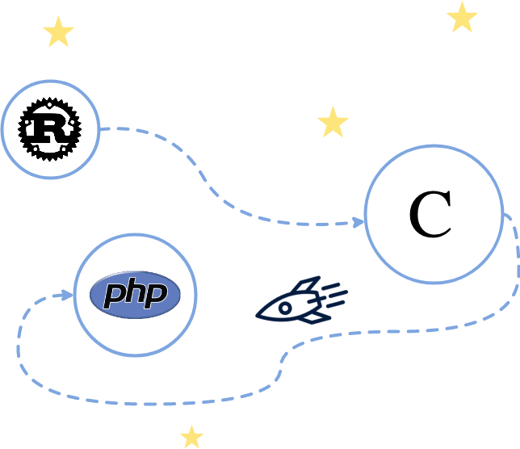

# 【译】从 Rust 到不只是 Rust：PHP 语言领域
>From Rust to beyond: The PHP galaxy 译文

>* 原文地址：https://mnt.io/2018/10/29/from-rust-to-beyond-the-php-galaxy/
>* 原文仓库：https://github.com/Hywan/gutenberg-parser-rs/tree/master/bindings/
>* 原文作者：[Ivan Enderlin](https://mnt.io/)
>* 译文出自：https://github.com/suhanyujie
>* 本文永久链接：（缺省）
>* 译者：[suhanyujie](https://github.com/suhanyujie)
>* 翻译不当之处，还请指出，谢谢！
>* tags：用 Rust 为 PHP 开发扩展；用 Rust 为 PHP 助力

这篇博客文章是“如何将 Rust 传播到其他语言领域”系列文章之一。Rust 完成进度：

- [前言](https://mnt.io/2018/08/21/from-rust-to-beyond-prelude/),
- [WebAssembly 领域](https://mnt.io/2018/08/22/from-rust-to-beyond-the-webassembly-galaxy/),
- [ASM.js 领域][https://mnt.io/2018/08/28/from-rust-to-beyond-the-asm-js-galaxy/],
- [C 领域][https://mnt.io/2018/09/11/from-rust-to-beyond-the-c-galaxy/],
- PHP 领域 (当前章节)，以及
- NodeJS 领域

我们今天探索的领域是 PHP 领域。这个文章解释了什么是 PHP，如何将 Rust 程序编译成 C 再转换成 PHP 原生扩展。

## PHP 是什么？为什么是它？
[PHP](https://secure.php.net/) is a:

>受欢迎的通用脚本语言，尤其是在 web 开发领域。从个人博客到世界上最流行的网站，PHP 提供了快速、灵活并且实用的功能。 

令人遗憾的是，PHP 近年来名声不佳，但是最近的发行版（从 PHP 7.0 开始）引入了许多简洁的语言特性，这些特性令人喜爱。PHP 也是一种快速脚本语言，并且非常灵活。PHP 现在已经具备了类型、性征、可变参数、闭包（带有显式范围）、生成器和强大的向后兼容特性。PHP 的开发由 [RFCs](https://wiki.php.net/rfc) 领导，整个过程是开放和民主的。Gutenberg 项目是 WordPress 的新编辑器。WordPress 是用 PHP 编写的。很自然的，我们需要一个 PHP 的本地扩展来解析 Gutenberg 文章格式。PHP 是一种具有[规范](https://github.com/php/php-langspec)的语言。其最流行的虚拟机是 [Zend Engine](http://php.net/manual/en/internals2.php)，还有一些其他虚拟机，比如 [HHVM](https://hhvm.com/)（但 HHVM 最近已经放弃对 PHP 的支持，转而支持他们团队自己的 PHP 分支，也称为 Hack），[Peachpie](https://www.peachpie.io/) 或 [Tagua VM](https://github.com/tagua-vm/tagua-vm)（正在开发中）。在本文中，我们将为 Zend Engine 创建一个扩展。这个虚拟机是 C 语言编写的。恰好跟之前的一篇文章 [C 系列](https://mnt.io/2018/09/11/from-rust-to-beyond-the-c-galaxy/) 相契合。

## Rust 🚀 C 🚀 PHP


要将 Rust 解析器移植到 PHP 中，我们首先需要将它移植到 C。这在上一篇文章中已经实现了。从这一端到 C 有两个文件：`libgutenberg_post_parser.a` 和 `gutenberg_post_parser.h`，分别是静态库和头文件。

### 使用脚手架引导
PHP 源码中自带了一个创建扩展的[脚手架/模板](http://php.net/manual/en/internals2.buildsys.skeleton.php)，是 [`ext_skel.php`](https://github.com/php/php-src/blob/master/ext/ext_skel.php)。这个脚本可以从 Zend Engine 虚拟机的源代码找到。可以这样对其使用：

```other
$ cd php-src/ext/
$ ./ext_skel.php \
      --ext gutenberg_post_parser \
      --author 'Ivan Enderlin' \
      --dir /path/to/extension \
      --onlyunix
$ cd /path/to/extension
$ ls gutenberg_post_parser
tests/
.gitignore
CREDITS
config.m4
gutenberg_post_parser.c
php_gutenberg_post_parser.h
```

`ext_skel.php` 脚本建议以如下步骤使用：

- 重新构建 PHP 源码配置（在 `php-src` 根目录下运行 `./buildconf`），
- 重新配置构建系统以启用扩展，如 `./configure --enable-gutenberg_post_parser`，
- 使用 `make` 构建
- 完成

但是我们的扩展很可能位于 `php-src` 以外的目录。所以我们使用 `phpize`。`phpize` 跟 `php`、`php-cgi`、`phpdbg`、`php-config` 等类似，是一个可执行文件。它让我们根据已编译的 `php` 二进制文件去编译扩展，这很符合在我们的例子。我们像下面这样使用它：

```other
$ cd /path/to/extension/gutenberg_post_parser

$ # Get the bin directory for PHP utilities.
$ PHP_PREFIX_BIN=$(php-config --prefix)/bin

$ # Clean (except if it is the first run).
$ $PHP_PREFIX_BIN/phpize --clean

$ # “phpize” the extension.
$ $PHP_PREFIX_BIN/phpize

$ # Configure the extension for a particular PHP version.
$ ./configure --with-php-config=$PHP_PREFIX_BIN/php-config

$ # Compile.
$ make install
```

在这篇文章中，我们将不再展示相关的代码修改，而是将重点放在扩展绑定上。所有的相关源码可以[在这里找到](https://github.com/Hywan/gutenberg-parser-rs/tree/master/bindings/php/extension/gutenberg_post_parser)，简单的说，这是 `config.m4` 文件的配置:

```other
PHP_ARG_ENABLE(gutenberg_post_parser, whether to enable gutenberg_post_parser support,
[  --with-gutenberg_post_parser          Include gutenberg_post_parser support], no)

if  test "$PHP_GUTENBERG_POST_PARSER" != "no"; then
  PHP_SUBST(GUTENBERG_POST_PARSER_SHARED_LIBADD)

  PHP_ADD_LIBRARY_WITH_PATH(gutenberg_post_parser, ., GUTENBERG_POST_PARSER_SHARED_LIBADD)

  PHP_NEW_EXTENSION(gutenberg_post_parser, gutenberg_post_parser.c, $ext_shared)
fi
```

它的作用主要有以下这些：
    - 在构建系统中注册 `--with-gutenberg_post_parser` 选项，并且
    - 声明要编译的静态库以及扩展源代码。

我么必须在同一级目录（链接符号是可用的）下添加 `libgutenberg_post_parser.a` 和 `gutenberg_post_parser.h` 文件，然后可以得到如下的目录结构：

```other
$ ls gutenberg_post_parser
tests/                       # from ext_skel
.gitignore                   # from ext_skel
CREDITS                      # from ext_skel
config.m4                    # from ext_skel (edited)
gutenberg_post_parser.c      # from ext_skel (will be edited)
gutenberg_post_parser.h      # from Rust
libgutenberg_post_parser.a   # from Rust
php_gutenberg_post_parser.h  # from ext_skel
```

扩展的核心是 `gutenberg_post_parser.c` 文件。这个文件负责创建模块，并且将 Rust 代码绑定到 PHP。

### 模块即扩展
如前所述，我们将在 `gutenberg_post_parser.c` 中实现我们的逻辑。首先，引入所需要的文件：

```c
#include "php.h"
#include "ext/standard/info.h"
#include "php_gutenberg_post_parser.h"
#include "gutenberg_post_parser.h"
```

The last line includes the `gutenberg_post_parser.h` file generated by Rust (more precisely, by `cbindgen`, if you don’t remember, [take a look at the previous episode](https://mnt.io/2018/09/11/from-rust-to-beyond-the-c-galaxy/)). Then, we have to decide what API we want to expose into PHP? As a reminder, the Rust parser produces an AST defined as:
最后一行引入的 `gutenberg_post_parser.h` 文件由 Rust 生成（准确的说是 `cbindgen` 生成的，如果你不记得，[阅读上一篇文章](https://mnt.io/2018/09/11/from-rust-to-beyond-the-c-galaxy/)）。接着，我们必须决定好向 PHP 暴露的 API，Rust 解析器生成的 AST 定义如下：

```rust
pub enum Node<'a> {
    Block {
        name: (Input<'a>, Input<'a>),
        attributes: Option<Input<'a>>,
        children: Vec<Node<'a>>
    },
    Phrase(Input<'a>)
}
```

AST 的 C 变体与上方的版本是类似的（具有很多结构，但思路几乎相同）。所以在 PHP 中，选择如下结构：

```php
class Gutenberg_Parser_Block {
    public string $namespace;
    public string $name;
    public string $attributes;
    public array $children;
}

class Gutenberg_Parser_Phrase {
    public string $content;
}

function gutenberg_post_parse(string $gutenberg_post): array;
```

The `gutenberg_post_parse` function will output an array of objects of kind `Gutenberg_Parser_Block` or `Gutenberg_Parser_Phrase`, i.e. our AST. So, let’s declare those classes!
`gutenberg_post_parse` 函数的所用是输出一个对象数组，对象类型是 `gutenberg_post_parse` 或 `Gutenberg_Parser_Phrase`，也就是我们的 AST。我们可以定义这些类。

### Declare the classes
_注意：后面的 4 个代码块不是本文的核心，它只是需要编写的代码，如果你不打算编写 PHP 扩展，可以跳过它_

```c
zend_class_entry *gutenberg_parser_block_class_entry;
zend_class_entry *gutenberg_parser_phrase_class_entry;
zend_object_handlers gutenberg_parser_node_class_entry_handlers;

typedef struct _gutenberg_parser_node {
    zend_object zobj;
} gutenberg_parser_node;
```

一个 class entry 代表一个特定的类型。并会有对应的处理程序与 class entry 相关联。逻辑有些复杂。如果你想了解更多内容，我建议你阅读 [PHP Internals Book](http://www.phpinternalsbook.com/)。接着，我们创建一个函数来实例化这些对象：

```c
static zend_object *create_parser_node_object(zend_class_entry *class_entry)
{
    gutenberg_parser_node *gutenberg_parser_node_object;

    gutenberg_parser_node_object = ecalloc(1, sizeof(*gutenberg_parser_node_object) + zend_object_properties_size(class_entry));

    zend_object_std_init(&gutenberg_parser_node_object->zobj, class_entry);
    object_properties_init(&gutenberg_parser_node_object->zobj, class_entry);

    gutenberg_parser_node_object->zobj.handlers = &gutenberg_parser_node_class_entry_handlers;

    return &gutenberg_parser_node_object->zobj;
}
```

然后，我们创建一个函数来释放这些对象。它的工作有两步：调用对象的析构函数（在用户态）来析构对象，然后将其释放（在虚拟机中）：

```c
static void destroy_parser_node_object(zend_object *gutenberg_parser_node_object)
{
    zend_objects_destroy_object(gutenberg_parser_node_object);
}

static void free_parser_node_object(zend_object *gutenberg_parser_node_object)
{
    zend_object_std_dtor(gutenberg_parser_node_object);
}
```

然后，我们初始化这个“模块”，也就是扩展。在初始化过程中，我们将在用户空间中创建类，并声明它的属性等。

```c
PHP_MINIT_FUNCTION(gutenberg_post_parser)
{
    zend_class_entry class_entry;

    // 声明 Gutenberg_Parser_Block.
    INIT_CLASS_ENTRY(class_entry, "Gutenberg_Parser_Block", NULL);
    gutenberg_parser_block_class_entry = zend_register_internal_class(&class_entry TSRMLS_CC);

    // 声明 create handler.
    gutenberg_parser_block_class_entry->create_object = create_parser_node_object;

    // 类是 final 的（不能被继承）
    gutenberg_parser_block_class_entry->ce_flags |= ZEND_ACC_FINAL;

    // 使用空字符串作为默认值声明 `namespace` 公共属性,
    zend_declare_property_string(gutenberg_parser_block_class_entry, "namespace", sizeof("namespace") - 1, "", ZEND_ACC_PUBLIC);

    // 使用空字符串作为默认值声明 `name` 公共属性
    zend_declare_property_string(gutenberg_parser_block_class_entry, "name", sizeof("name") - 1, "", ZEND_ACC_PUBLIC);

    // 使用 `NULL` 作为默认值声明 `attributes` 公共属性
    zend_declare_property_null(gutenberg_parser_block_class_entry, "attributes", sizeof("attributes") - 1, ZEND_ACC_PUBLIC);

    // 使用 `NULL` 作为默认值，声明 `children` 公共属性
    zend_declare_property_null(gutenberg_parser_block_class_entry, "children", sizeof("children") - 1, ZEND_ACC_PUBLIC);

    // 声明 Gutenberg_Parser_Block.

    … skip …

    // 声明 Gutenberg 解析器节点对象 handler

    memcpy(&gutenberg_parser_node_class_entry_handlers, zend_get_std_object_handlers(), sizeof(gutenberg_parser_node_class_entry_handlers));

    gutenberg_parser_node_class_entry_handlers.offset = XtOffsetOf(gutenberg_parser_node, zobj);
    gutenberg_parser_node_class_entry_handlers.dtor_obj = destroy_parser_node_object;
    gutenberg_parser_node_class_entry_handlers.free_obj = free_parser_node_object;

    return SUCCESS;
}
```

如果你还在阅读，首先我表示感谢，其次，恭喜！接着，代码中有 `PHP_RINIT_FUNCTION` 和 `PHP_MINFO_FUNCTION` 函数，它们是由 `ext_skel.php` 脚本生成的。模块条目信息和模块配置也是这样生成的。

### `gutenberg_post_parse` 函数
现在我们将重点介绍 `gutenberg_post_parse` 函数。该函数接收一个 字符串作为参数，如果解析失败，则返回 `false`，否则返回类型为 `Gutenberg_Parser_Block` 或 `Gutenberg_Parser_Phrase` 的对象数组。我们开始编写它！注意它是由 [`PHP_FUNCTION` 宏](https://github.com/php/php-src/blob/52d91260df54995a680f420884338dfd9d5a0d49/main/php.h#L400)声明的.

```c
PHP_FUNCTION(gutenberg_post_parse)
{
    char *input;
    size_t input_len;

    // 将 input 作为字符串读入
    if (zend_parse_parameters(ZEND_NUM_ARGS() TSRMLS_CC, "s", &input, &input_len) == FAILURE) {
        return;
    }
```

在这个步骤中，参数已经作为字符串（`"s"`）被声明和引入了。字符串值在 `input` 中，字符串长度存储在 `input_len`。下一步就是解析 `input`。（实际上不需要字符串长度）。这就是我们要调用 Rust 代码的地方！我们可以这样做：

```c
    // 解析 input
    Result parser_result = parse(input);

    // 如果解析失败，则返回 false.
    if (parser_result.tag == Err) {
        RETURN_FALSE;
    }

    // 否则将 Rust 的 AST 映射到 PHP 的数组中
    const Vector_Node nodes = parse_result.ok._0;
```

`Result` 类型和 `parse` 函数是 Rust 中的。如果你不记得这些类型，可以阅读前一篇[关于 C 领域的文章](https://mnt.io/2018/09/11/from-rust-to-beyond-the-c-galaxy/)。Zend Engine 有 `RETURN_FALSE` 宏，用于返回 `false`！很方便是吗？最后，如果顺利，我们将得到 `Vector_Node` 类型的节点集合。下一步是将它们映射到 PHP 类型中，如 Gutenberg 类型的数组。我们开始干吧：

```c
    // 注意：return_value 是一个"魔术"变量，它用于存放返回值
    //
    // 分配一个数组空间
    array_init_size(return_value, nodes.length);

    // 映射 Rust AST
    into_php_objects(return_value, &nodes);
}
```

完事了 😁！噢，等等 …… 还要实现 `into_php_objects`函数！

### `into_php_objects` 函数
This function is not terribly complex: It’s just full of Zend Engine specific API as expected. We are going to explain how to map a `Block` into a `Gutenberg_Parser_Block` object, and to let the `Phrase` mapping to `Gutenberg_Parser_Phrase` for the assiduous readers. And there we go:

```c
void into_php_objects(zval *php_array, const Vector_Node *nodes)
{
    const uintptr_t number_of_nodes = nodes->length;

    if (number_of_nodes == 0) {
        return;
    }

    // Iterate over all nodes.
    for (uintptr_t nth = 0; nth < number_of_nodes; ++nth) {
        const Node node = nodes->buffer[nth];

        if (node.tag == Block) {
            // Map Block into Gutenberg_Parser_Block.
        } else if (node.tag == Phrase) {
            // Map Phrase into Gutenberg_Parser_Phrase.
        }
    }
}
```

Now let’s map a block. The process is the following:
    1. Allocate PHP strings for the block namespace, and for the block name,
    2. Allocate an object,
    3. Set the block namespace and the block name to their respective object properties,
    4. Allocate a PHP string for the block attributes if any,
    5. Set the block attributes to its respective object property,
    6. If any children, initialise a new array, and call `into_php_objects` with the child nodes and the new array,
    7. Set the children to its respective object property,
    8. Finally, add the block object inside the array to be returned.

```c
const Block_Body block = node.block;
zval php_block, php_block_namespace, php_block_name;

// 1. Prepare the PHP strings.
ZVAL_STRINGL(&php_block_namespace, block.namespace.pointer, block.namespace.length);
ZVAL_STRINGL(&php_block_name, block.name.pointer, block.name.length);
```

Do you remember that namespace, name and other similar data are of type `Slice_c_char`? It’s just a structure with a pointer and a length. The pointer points to the original input string, so that there is no copy (and this is the definition of a slice actually). Well, Zend Engine has [a `ZVAL_STRINGL` macro](https://github.com/php/php-src/blob/52d91260df54995a680f420884338dfd9d5a0d49/Zend/zend_API.h#L563-L565) that allows to create a string from a pointer and a length, great! Unfortunately for us, Zend Engine does [a copy behind the scene](https://github.com/php/php-src/blob/52d91260df54995a680f420884338dfd9d5a0d49/Zend/zend_string.h#L152-L159)… There is no way to keep the pointer and the length only, but it keeps the number of copies small. I think it is to take the full ownership of the data, which is required for the garbage collector.

```c
// 2. Create the Gutenberg_Parser_Block object.
object_init_ex(&php_block, gutenberg_parser_block_class_entry);
```

The object has been instanciated with a class represented by the `gutenberg_parser_block_class_entry`.

```c
// 3. Set the namespace and the name.
add_property_zval(&php_block, "namespace", &php_block_namespace);
add_property_zval(&php_block, "name", &php_block_name);

zval_ptr_dtor(&php_block_namespace);
zval_ptr_dtor(&php_block_name);
```

The `zval_ptr_dtor` adds 1 to the reference counter. This is required for the garbage collector.

```c
// 4. Deal with block attributes if some.
if (block.attributes.tag == Some) {
    Slice_c_char attributes = block.attributes.some._0;
    zval php_block_attributes;

    ZVAL_STRINGL(&php_block_attributes, attributes.pointer, attributes.length);

    // 5. Set the attributes.
    add_property_zval(&php_block, "attributes", &php_block_attributes);

    zval_ptr_dtor(&php_block_attributes);
}
```

It is similar to what has been done for `namespace` and `name`. Now let’s continue with children.

```c
// 6. Handle children.
const Vector_Node *children = (const Vector_Node*) (block.children);

if (children->length > 0) {
    zval php_children_array;

    array_init_size(&php_children_array, children->length);

    // Recursion.
    into_php_objects(&php_children_array, children);

    // 7. Set the children.
    add_property_zval(&php_block, "children", &php_children_array);

    Z_DELREF(php_children_array);
}

free((void*) children);
```

Finally, add the block instance into the array to be returned:

```c
// 8. Insert the object in the collection.
add_next_index_zval(php_array, &php_block);
```

[The entire code lands here.](https://github.com/Hywan/gutenberg-parser-rs/blob/master/bindings/php/extension/gutenberg_post_parser/gutenberg_post_parser.c)

## PHP extension 🚀 PHP userland
Now the extension is written, we have to compile it. That’s the repetitive set of commands we have shown above with `phpize`. Once the extension is compiled, the `generated gutenberg_post_parser.so` file must be located in the extension directory. This directory can be found with the following command:

```other
$ php-config --extension-dir
```

For instance, in my computer, the extension directory is `/usr/local/Cellar/php/7.2.11/pecl/20170718`. Then, to enable the extension for a given execution, you must write:

```other
$ php -d extension=gutenberg_post_parser -m | \
      grep gutenberg_post_parser
```

Or, to enable the extension for all executions, locate the `php.ini` file with `php --ini` and edit it to add:

```other
extension=gutenberg_post_parser
```

Done! Now, let’s use some reflection to check the extension is correctly loaded and handled by PHP:

```other
$ php --re gutenberg_post_parser
Extension [ <persistent> extension #64 gutenberg_post_parser version 0.1.0 ] {

  - Functions {
    Function [ <internal:gutenberg_post_parser> function gutenberg_post_parse ] {

      - Parameters [1] {
        Parameter #0 [ <required> $gutenberg_post_as_string ]
      }
    }
  }

  - Classes [2] {
    Class [ <internal:gutenberg_post_parser> final class Gutenberg_Parser_Block ] {

      - Constants [0] {
      }

      - Static properties [0] {
      }

      - Static methods [0] {
      }

      - Properties [4] {
        Property [ <default> public $namespace ]
        Property [ <default> public $name ]
        Property [ <default> public $attributes ]
        Property [ <default> public $children ]
      }

      - Methods [0] {
      }
    }

    Class [ <internal:gutenberg_post_parser> final class Gutenberg_Parser_Phrase ] {

      - Constants [0] {
      }

      - Static properties [0] {
      }

      - Static methods [0] {
      }

      - Properties [1] {
        Property [ <default> public $content ]
      }

      - Methods [0] {
      }
    }
  }
}
```

Everything looks good: There is one function and two classes that are defined as expected. Now, let’s write some PHP code for the first time in this blog post!

```php
<?php

var_dump(
    gutenberg_post_parse(
        '<!-- wp:foo /-->bar<!-- wp:baz -->qux<!-- /wp:baz -->'
    )
);

/**
 * Will output:
 *     array(3) {
 *       [0]=>
 *       object(Gutenberg_Parser_Block)#1 (4) {
 *         ["namespace"]=>
 *         string(4) "core"
 *         ["name"]=>
 *         string(3) "foo"
 *         ["attributes"]=>
 *         NULL
 *         ["children"]=>
 *         NULL
 *       }
 *       [1]=>
 *       object(Gutenberg_Parser_Phrase)#2 (1) {
 *         ["content"]=>
 *         string(3) "bar"
 *       }
 *       [2]=>
 *       object(Gutenberg_Parser_Block)#3 (4) {
 *         ["namespace"]=>
 *         string(4) "core"
 *         ["name"]=>
 *         string(3) "baz"
 *         ["attributes"]=>
 *         NULL
 *         ["children"]=>
 *         array(1) {
 *           [0]=>
 *           object(Gutenberg_Parser_Phrase)#4 (1) {
 *             ["content"]=>
 *             string(3) "qux"
 *           }
 *         }
 *       }
 *     }
 */
```

It works very well!

## Conclusion
The journey is:
    - A string written in PHP,
    - Allocated by the Zend Engine from the Gutenberg extension,
    - Passed to Rust through FFI (static library + header),
    - Back to Zend Engine in the Gutenberg extension,
    - To generate PHP objects,
    - That are read by PHP.

Rust fits really everywhere! We have seen in details how to write a real world parser in Rust, how to bind it to C and compile it to a static library in addition to C headers, how to create a PHP extension exposing one function and two objects, how to integrate the C binding into PHP, and how to use this extension in PHP. As a reminder, the C binding is about 150 lines of code. The PHP extension is about 300 lines of code, but substracting “decorations” (the boilerplate to declare and manage the extension) that are automatically generated, the PHP extension reduces to about 200 lines of code. Once again, I find this is a small surface of code to review considering the fact that the parser is still written in Rust, and modifying the parser will not impact the bindings (except if the AST is updated obviously)! PHP is a language with a garbage collector. It explains why all strings are copied, so that they are owned by PHP itself. However, the fact that Rust does not copy any data saves memory allocations and deallocations, which is the biggest cost most of the time. Rust also provides safety. This property can be questionned considering the number of binding we are going through: Rust to C to PHP: Does it still hold? From the Rust perspective, yes, but everything that happens inside C or PHP must be considered unsafe. A special care must be put in the C binding to handle all situations. Is it still fast? Well, let’s benchmark. I would like to remind that the first goal of this experiment was to tackle the bad performance of the original PEG.js parser. On the JavaScript ground, WASM and ASM.js have shown to be very much faster (see [the WebAssembly galaxy](https://mnt.io/2018/08/22/from-rust-to-beyond-the-webassembly-galaxy/), and [the ASM.js galaxy](https://mnt.io/2018/08/28/from-rust-to-beyond-the-asm-js-galaxy/)). For PHP, [`phpegjs` is used](https://github.com/nylen/phpegjs): It reads the grammar written for PEG.js and compiles it to PHP. Let’s see how they compare:

文件名 | PEG PHP parser (ms) | Rust parser as a PHP extension (ms) | 提升倍数
---| ---- |---- |---
[`demo-post.html`](https://raw.githubusercontent.com/dmsnell/gutenberg-document-library/master/library/demo-post.html) | 30.409 |  0.0012   |  × 25341
[`shortcode-shortcomings.html`](https://raw.githubusercontent.com/dmsnell/gutenberg-document-library/master/library/shortcode-shortcomings.html) | 76.39 |  0.096   | × 796
[`redesigning-chrome-desktop.html`](https://raw.githubusercontent.com/dmsnell/gutenberg-document-library/master/library/redesigning-chrome-desktop.html) | 225.824 |  0.399   |  × 566
[`web-at-maximum-fps.html`](https://raw.githubusercontent.com/dmsnell/gutenberg-document-library/master/library/web-at-maximum-fps.html) | 173.495 |  0.275   |  × 631
[`early-adopting-the-future.html`](https://raw.githubusercontent.com/dmsnell/gutenberg-document-library/master/library/early-adopting-the-future.html) | 	280.433 |  0.298   |  × 941
[`pygmalian-raw-html.html`](https://raw.githubusercontent.com/dmsnell/gutenberg-document-library/master/library/pygmalian-raw-html.html) | 377.392 |  	0.052   |  × 7258
[`moby-dick-parsed.html`](https://raw.githubusercontent.com/dmsnell/gutenberg-document-library/master/library/moby-dick-parsed.html) | 5,437.630 |  5.037   |  × 1080

The PHP extension of the Rust parser is in average 5230 times faster than the actual PEG PHP implementation. The median of the speedup is 941. Another huge issue was that the PEG parser was not able to handle many Gutenberg documents because of a memory limit. Of course, it is possible to grow the size of the memory, but it is not ideal. With the Rust parser as a PHP extension, memory stays constant and close to the size of the parsed document. I reckon we can optimise the extension further to generate an iterator instead of an array. This is something I want to explore and analyse the impact on the performance. The PHP Internals Book has a [chapter about Iterators](http://www.phpinternalsbook.com/classes_objects/iterators.html). We will see in the next episodes of this series that Rust can reach a lot of galaxies, and the more it travels, the more it gets interesting. Thanks for reading!
