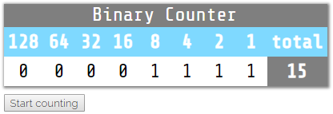
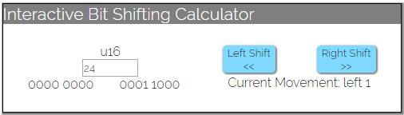
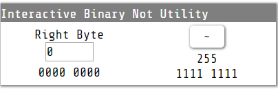

# 【译】理解二进制（1）

>* 原文地址：https://wiredforge.com/blog/binary-pt1/index.html
>* 原文作者：[freemasen](https://github.com/freemasen)
>* 译文出自：https://github.com/suhanyujie
>* 本文永久链接： https://github.com/suhanyujie/article-transfer-rs/blob/master/src/2019/Understanding_Binary_Pt_1.md
>* 译者：[suhanyujie](https://github.com/suhanyujie)

> 正文开始

* 如果你对计算机感兴趣有一段时间了，可能有人已经告诉你计算机使用二进制“思考”。我将试着解释它到底是什么，以及你为什么应该了解它。

## 快速定义
* 作为人类，我们通常以10为基数进行计数，这意味着每个状态最多可以有 10 个不同的值（0-9）。二进制数字系统则最多只能有2个不同的值， 0 或 1 。为了解决这一限制，创建了一个计数系统，其中每个位置都有一个进位，通过向对应的位添加 1 来计数。
* 要说明这是如何工作的，请思考下面这个计数表（tips:原文中有计数特效，可以移驾原文查看，这里只放截图）：
* 
* 如果单击第2 行中的任何单元格，它将把表头中的数字添加到总值中。你也可以点击 “start counting” 按钮来观看从 0 到 255 的计数效果。
* 需要指出的一件有意思的细节是，每个值恰好比该值右边的所有值都大 1 。

```
1 + 2         =  3 =  4 - 1
1 + 2 + 4     =  7 =  8 - 1
1 + 2 + 4 + 8 = 15 = 16 - 1
```

* 同样的，当你向左移动时，数字总是会翻倍。

```
2 = 1 * 2
4 = 2 * 2
8 = 4 * 2
```

* 现在，我们已经对如何使用二进制计数有一个打开的了解，让我们看看如何使用更有效的方式。
* 在之前的很久一段时间里，计算机界就认为 8 是一个用作构建分界的很合适的数字。你可能听说过一个字节有8位。如果我们考虑上面的表，每一列表示一个位，这意味着整个表表示一个字节。下面的例子大多是 8 位数字，但是也有 16 位数字的例子，要注意，同样的概念适用于这两个 16 位数字，只是能够得到比 255 大的多的数字。

## 使其更有使用价值
* 现在我们都理解了二进制数是如何构造的，让我们来利用这个新知识。我最喜欢使用这个信息创建 `Bit Flags`， `Bit Flags` 你可以理解为上面的表中的每个数字所代表的意思。因为每个数字都表示一个位的位置，所以现在，我们可以使用这些位的数字任意组合成一个独特的值。我们使用一下这个例子。

```
//JobState Big Flags
const new_job = 1;
const assigned_job = 2;
const in_progress_job = 4;
const complete_job = 8;
const reopened_job = 16;
const archived_job = 32;
```

* 由于我们使用这些特殊的值表示 `JobState` ，所以这些值不再互相排斥。我们可以使用值 24 (0001 1000) 获得 `complete_job` 和 `reopened_job` 的状态，或者使用值 6 (0000 0110) 同时获得 `assigned_job` 和 `in_progress_job` 的状态。本质上，我们使用数字表示一组东西。
* 利用这些信息，这将伴随着一些特殊的二进制操作。

## 二进制操作符
* 由于编程语言中的所有数字都可以归结为二进制，所以我们可以使用一些强大的方法来组合数字，而不仅仅是加法、减法、乘法、和除法。我要介绍的第一个是 `bit shifting` 。

## 位移运算
* 位移运算是指我们取得一个数的一个位，然后向左或者向右移动。由于每个位的值都是其右邻位的 2 倍，因此会得到一些非常有趣的结论。位运算通常由操作符 `<<` 和 `>>` 各自指向偏移的方向来表示。下面是一些位移运算的例子，注意每个例子的二进制表示都在 10 的基数之上。

```
0000 0001 << 1 = 0000 0010
    1     << 1 =     2
0000 0010 << 3 = 0001 0000
    2     << 3 =    16
0001 0000 >> 1 = 0000 1000
   16     >> 1 =     8
0000 1000 >> 2 = 0000 0010
    8     >> 2 =     2
```

* 为了使用 `JobState` 比特位的例子，我们可以使用这个操作符从一个状态移动到下一个状态。

```
job_state = new_job;
job_state = job_state << 1;
//job_state == assigned_job
job_state = job_state << 1;
//job_state == in_progress_job
job_state = job_state << 1;
//job_state == complete_job
job_state = job_state >> 3;
//job_state == new_job
```

* 我把下面这个小工具放在这里可以更生动的说明这一点，它虽然是为 16 位数字设置的，但概念是类似的。
* 

## 按位或
* 接下来是“按位或”运算。当我们使用这个操作符时，我们所做的是从两个数字中取出各自对应的 1 个位运算生成一个新的数字。这个操作通常使用 `|` 符号表示，它通常也作为管道字符引用。这里有几个例子，同样的，二进制数字在上面，10进制的在下面。

```
0000 0001 | 0000 0010 = 0000 0011
    1     |     2     =     3
0000 0010 | 0001 0000 = 0001 0010
    2     |     16    =     18
0001 0000 | 0000 1000 = 0001 1000
   16     |     8     =     24
0000 1000 | 0000 0010 = 0000 1010
    8     |     2     =     10
1100 0000 | 1000 1000 = 1100 1000
   192    |    136    =    200
```

* 首先，看起来我们得到的结果和 `+` 得到的结果是一样的，但是看最后一个例子。对于这两个数，最左边的 2 个位都是 1 ，但对于 | ，128 所在的位只会包含在结果中一次，而当使用 `+` 运算符，将包含 128 两次（结果是 328）。
* 我们可以使用它来组合两个 job_states

```
job_state = reopened_job | assigned_job;
//job_state == 18
```

* 现在，我们可以很容易的表示处于多个状态的运算，而不需要为组合定义可能未知的新状态。看看，当我们显式的做这个时，我们的状态列表将会变得有多大

```
const new_job = 1;
const assigned_job = 2;
const new_assigned_job = 3;
const in_progress_job = 4;
const new_inprogress_job = 5
const assigned_in_progress_job = 6
const new_assigned_in_progress_job = 7
const complete_job = 8;
const new_complete_job = 9;
const assigned_complete_job = 10;
const new_assigned_complete_job = 11;
const in_progress_complete_job = 12;
const new_in_progress_complete_job = 13;
const assigned_in_progress_complete_job = 14;
const new_assigned_in_progress_complete_job = 15;
const reopened_job = 16;
const new_reopened_job = 17;
const assigned_reopened_job = 18;
const new_assigned_reopened_job = 19;
```

* 这就复杂的多，而且在某种程度上，这种努力是无效的，正如：有一份在进行中的新工作或者正在进行并完成的工作是不存在的（互斥）。

## 按位和
* `bitwise or` 和 `bitwise and` 是一对好朋友，两个相似的概念有一个主要区别。与 and 的最大区别在于，当两个数都为 1 时，我们的结果应该只包含每个数为 1 的位。该操作由 `&` 操作符表示。这里有一些例子：

```
1010 1010 & 0101 0101 = 0000 0000
   170    &     85    =     0
1111 1111 & 0101 0101 = 0101 0101
   255    &     85    =     85
1100 0000 & 1000 1000 = 1000 0000
   192    &    136    =    128
```

* 这允许我们检查 job 是否处于某种局部状态

```rust
job_state = reopened_job | assigned_job;
if job_state & assigned_job > 0 {
    //put this job in the assignee's queue
}
```

* 坦白的讲，这不是很有用，因为我们可以检查 `job_state | new_job == 0` 与另外一种选项是否得到同样的结果。如果我们需要一个完全反转的一个标志，它也许是有用的，我们的 job 状态示例可能不是最佳的实际场景，但请考虑一下以下情况。

```rust
const step1 = 1;
const step2 = 2;
const done = 4;
//start the activity
let mut activity = step1; //1
//move to the next step but keep the step1 bit for audit purposes
activity = activity | step2; //3
//complete activity and clear audit trail
activity = ~activity; //4
```

* 

## 异或
* 我们要将的最后一个操作符是“异或”，它通常用 `^` 运算符表示。这个操作符将取两个数字，运算后生成一个新的数字，其中 1 的位只能在其中一边，或者另一边，而不是两者都是 1 。

```
1010 1010 ^ 0101 0101 = 1111 1111
   170    ^     85    =    255
1111 1111 ^ 0101 0101 = 1010 1010
   255    ^     85    =    170
1100 0000 ^ 1000 1000 = 0100 1000
   192    ^    136    =    72
```

* 我们可以对它的当前值的想对项进行一些翻转。

```rust
job_state = complete_job
job_state = job_state ^ complete_job;
//job_state & complete_job == 0
job_state = job_state ^ complete_job;
//job_state & complete_job == complete_job
```

* 虽然不是最有用的东西，但它肯定有它的使用场景。这里有一个交互工具来展示效果。
* 

## 一些有用的特性
* 现在我想讲一些与语言有关的东西。确保你阅读了文档，以了解这些东西在你选择的语言中是如何工作的。

### Bitflag 枚举
* 许多语言都允许你创建枚举类型，它提供了与我们刚刚讨论过的一些特性。通常这种类型可以通过使用一些注解，例如在 `c#` 中你可以这样做。

```cSharp
[Flags]
enum JobState {
    New = 1,
    Assigned = 2,
    InProgress = 4,
    Complete = 8,
    ReOpened = 16,
    Archived = 32
}
```

* 可以这样使用它

```cSharp
if (job_state & JobState.Complete > 0) {
    //deal with a complete job
}
```

* 这将大大提高代码的可读性


### 分配运算符
* 大多数语言都允许将任何运算符和 `=` 组合在一起，以便执行带有变量值的操作并赋值给该变量，例如 `+=` 。如果我们从上面的“异或”例子，我们可以看到它可以更简洁。

```rust
job_state = complete_job
job_state ^= complete_job;
//job_state & complete_job == 0
job_state ^= complete_job;
//job_state & complete_job == complete_job
```

## 总结
* 到这里就结束了二进制在一般编程中的使用。希望现在你已经有了一些关于在你的下一个项目中可以使用它的思路，开始时它可能会让你有些不太适应，但一旦你掌握了它的诀窍，它就会很好用很强大。
* 本系列的下一篇文章将概述数字是如何使用二进制表示，尽请关注！
